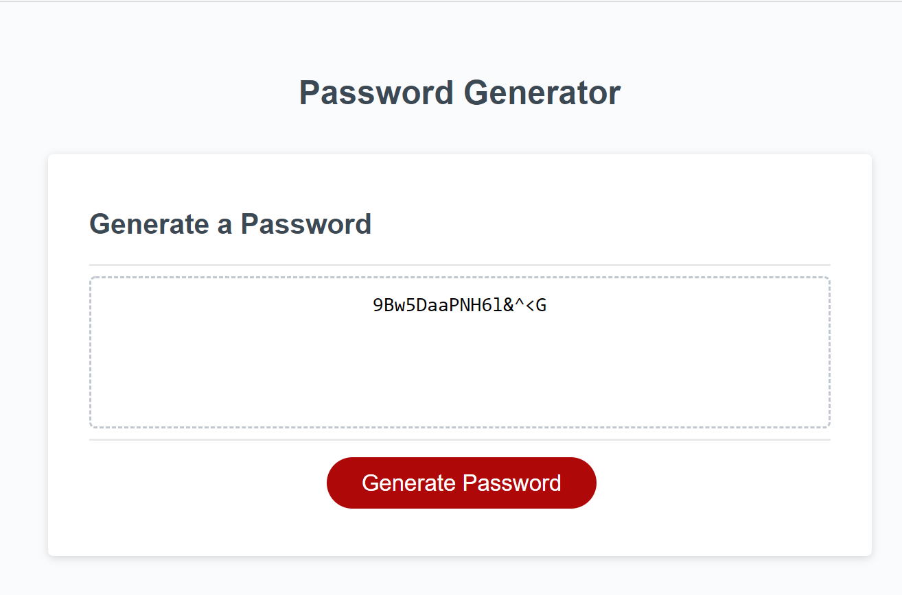

# Passgenerator
## An aplication that helps you to create a password in between 8 to 128 chracters.

## Description:
As a user of computers that Have so many passwordsfrom so many different apps, I wan to be able to change them for a harder password not being able to get hack. You can use this app. 
When you press the button **"Password Generator"** you have some prompts, asking the user to choose the number of characters, either they need symbols, numbers, uppercase or lowercase in their password.
as a result of the user's information, then the user gets a password with different characters and the number of characters requested.

## GitHub Repo:
# [Passgenerator](https://github.com/Fabscg/passgenerator)

## Deployed URL:
# [https://fasbskickass.github.io/passgenerator](https://fabscg.github.io/passgenerator/)

## Screenshot:
# 
